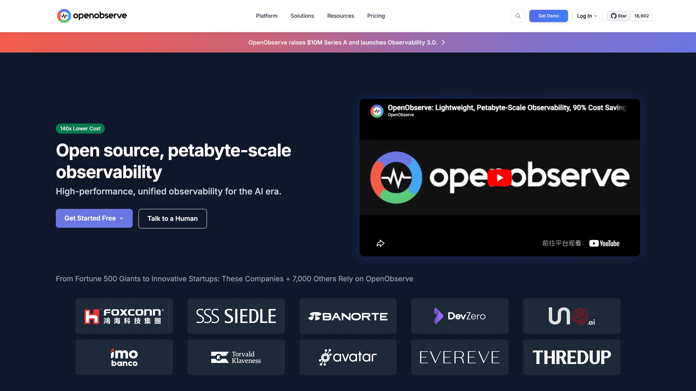

# Deploy and Host OpenObserve on Sealos

OpenObserve is an open-source observability platform for logs, metrics, traces, dashboards, alerts, and real user monitoring. This template deploys a single-node OpenObserve instance with persistent storage and HTTPS ingress on Sealos Cloud.

## About Hosting OpenObserve

OpenObserve runs as a Kubernetes StatefulSet and stores its data in a persistent volume mounted at `/data`. The template sets the root administrator email and password from deployment inputs, so the instance is ready for first login after the container finishes booting.

Sealos provisions the public HTTPS endpoint, internal service discovery, persistent storage, and Canvas operations surface. You can later adjust compute, storage, and network settings through the Canvas AI dialog or resource cards.

## Common Use Cases

- **Centralized Log Search**: Collect and query application logs from services and jobs.
- **Metrics Dashboards**: Build operational dashboards for infrastructure and application metrics.
- **Trace Analysis**: Inspect distributed traces when debugging latency or failures.
- **Alerting Workflows**: Configure monitors and alert destinations for production signals.
- **RUM Analysis**: Track frontend performance, errors, and session data.

## Dependencies for OpenObserve Hosting

The Sealos template includes all required runtime dependencies: the OpenObserve container, a persistent data volume, a Kubernetes Service, HTTPS Ingress, and a Sealos App link.

### Deployment Dependencies

- [OpenObserve Documentation](https://openobserve.ai/docs/) - Official documentation
- [OpenObserve GitHub Repository](https://github.com/openobserve/openobserve) - Source code and releases
- [OpenObserve Docker Images](https://gallery.ecr.aws/zinclabs/openobserve) - Published container images
- [Sealos Documentation](https://sealos.io/docs) - Platform usage and operations

## Implementation Details

### Architecture Components

This template deploys the following resources:

- **OpenObserve StatefulSet (`public.ecr.aws/zinclabs/openobserve:v0.90.3`)**: Serves the web UI and API on port `5080`.
- **Persistent Volume (`/data`, 1Gi)**: Stores OpenObserve metadata and local data.
- **Service + Ingress**: Exposes OpenObserve internally and publishes an HTTPS endpoint externally.
- **Sealos App Resource**: Adds a Canvas application link to the OpenObserve web UI.

### Configuration

The template exposes these deployment inputs:

- `mail`: Root administrator email, used as the login username.
- `password`: Root administrator password.
- `data_dir`: Data directory path, defaulting to `/data`.

The application container uses `500m` CPU / `512Mi` memory limits with `50m` CPU / `51Mi` memory requests. Live validation showed about `197Mi` memory usage after the first cold start and about `178Mi` after a probe-enabled restart, so `512Mi` is the smallest safe Sealos ladder value for this template.

### License Information

OpenObserve is distributed by the OpenObserve project. Review the upstream repository for current license details.

## Why Deploy OpenObserve on Sealos?

Sealos is an AI-assisted Cloud Operating System built on Kubernetes that simplifies deployment and day-2 operations. By deploying OpenObserve on Sealos, you get:

- **One-Click Deployment**: Launch OpenObserve without manually writing Kubernetes manifests.
- **Kubernetes Reliability Without Complexity**: Use Kubernetes-backed scheduling, storage, and networking through a simple app template.
- **Persistent Storage Included**: Keep observability data across restarts.
- **Secure Public Access**: Get an automatic HTTPS endpoint with Sealos-managed ingress.
- **Easy Customization**: Use Canvas AI dialog and resource cards for post-deployment changes.
- **Pay-as-You-Go Efficiency**: Tune resources as ingestion volume grows.

Deploy OpenObserve on Sealos and focus on observability workflows instead of infrastructure maintenance.

## Deployment Guide

1. Open the [OpenObserve template](https://sealos.io/products/app-store/openobserve) and click **Deploy Now**.
2. Configure the parameters in the popup dialog:
   - `mail`
   - `password`
   - `data_dir`
3. Wait for deployment to complete (typically 2-3 minutes). After deployment, you will be redirected to Canvas. For later changes, describe your requirements in the dialog to let AI apply updates, or click the relevant resource cards to modify settings.
4. Access OpenObserve via the generated URL and log in with `mail` as the username and `password` as the password.

## Configuration

After deployment, you can manage OpenObserve through:

- **AI Dialog**: Request resource or configuration changes in Canvas.
- **Resource Cards**: Modify StatefulSet, Service, Ingress, and storage settings.
- **OpenObserve UI**: Configure organizations, streams, dashboards, alerts, and ingestion endpoints.

## Scaling

To scale OpenObserve:

1. Open the Canvas for your deployment.
2. Click the OpenObserve StatefulSet resource card.
3. Increase CPU and memory for heavier ingestion or query workloads.
4. Expand the `/data` persistent volume as stored data grows.

## Troubleshooting

### Common Issues

**Issue: Login fails after deployment**
- Cause: The email or password entered during deployment does not match the configured root credentials.
- Solution: Use the `mail` input as the username and the `password` input as the password.

**Issue: Ingestion or queries are slow**
- Cause: Resource limits are too small for the current ingestion rate or query workload.
- Solution: Increase StatefulSet CPU and memory in Canvas.

### Getting Help

- [OpenObserve Documentation](https://openobserve.ai/docs/)
- [OpenObserve GitHub Issues](https://github.com/openobserve/openobserve/issues)
- [Sealos Discord](https://discord.gg/wdUn538zVP)

## Additional Resources

- [OpenObserve API Documentation](https://openobserve.ai/docs/api/)
- [OpenObserve Ingestion Guide](https://openobserve.ai/docs/ingestion/)
- [Sealos Documentation](https://sealos.io/docs)

## License

This Sealos template follows repository licensing terms. OpenObserve itself is distributed by the upstream OpenObserve project.
